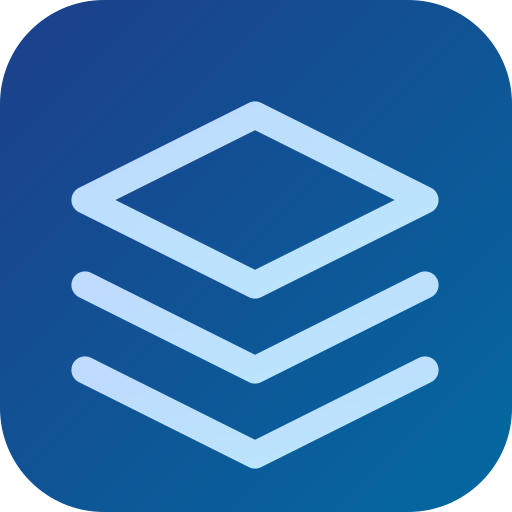

# LanFlare

<div align="center">



**快速、安全的局域网文件传输和剪贴板同步工具**

[](LICENSE)
[](https://github.com/yourusername/LanFlare)
[](https://www.electronjs.org/)

[English](README.md) | [简体中文](README.zh-CN.md)

</div>

## ✨ 特性

- 🚀 **高速传输** - 局域网内直连，无需服务器中转
- 📁 **多种传输方式** - 支持文件、文件夹、文本、剪贴板内容
- 🔗 **剪贴板同步** - 实时同步剪贴板内容（文本、图片、文件）
- 🌐 **Web 接收端** - 支持浏览器直接上传文件
- 🔒 **连接授权** - 设备连接需要授权，保护隐私安全
- 🎯 **零配置** - 自动发现局域网设备，即开即用
- 💻 **跨平台** - 支持 Windows、Linux、macOS

## 📸 截图

> 待添加应用截图

## 🚀 快速开始

### 下载

从 [Releases](https://github.com/yourusername/LanFlare/releases) 页面下载适合您系统的版本：

- **Windows**: `LanFlare-1.0.0-Windows-x64-Setup.exe` 或 `LanFlare-1.0.0-Windows-x64-Portable.exe`
- **macOS (Apple Silicon)**: `LanFlare-1.0.0-macOS-arm64.dmg`
- **macOS (Intel)**: `LanFlare-1.0.0-macOS-x64.dmg`
- **Linux x64**: `LanFlare-1.0.0-Linux-x64.AppImage` / `.deb` / `.rpm`
- **Linux arm64**: `LanFlare-1.0.0-Linux-arm64.AppImage` / `.deb` / `.rpm`

### 使用

1. **启动应用** - 在所有需要传输文件的设备上启动 LanFlare
2. **自动发现** - 应用会自动发现局域网内的其他 LanFlare 设备
3. **选择设备** - 从左侧设备列表选择目标设备
4. **授权连接** - 目标设备会弹出连接请求，点击"同意连接"
5. **开始传输** - 选择要发送的文件、文件夹或文本

### 功能说明

#### 📤 发送文件

- **发送文件**: 点击"发送文件"按钮选择单个或多个文件
- **发送文件夹**: 点击"发送文件夹"按钮选择整个文件夹
- **拖拽发送**: 将文件或文件夹拖拽到窗口中央即可发送
- **发送文本**: 点击"发送文本"按钮输入要发送的文字
- **发送剪贴板**: 点击"发送剪贴板"按钮发送当前剪贴板内容

#### 📥 接收文件

所有接收的文件自动保存到 `~/Downloads/LanFlare` 目录，可在"接收记录"标签页查看：

- 点击文件名打开文件
- 点击"打开接收文件夹"按钮查看所有接收的文件
- 右键菜单可删除记录或文件

#### 🔗 剪贴板同步

1. 在"剪贴板同步"标签页选择要同步的设备
2. 点击设备卡片右上角的"开启同步"按钮
3. 开启后，复制的内容会自动同步到目标设备

支持同步：
- 文本内容
- 图片（PNG 格式）
- 文件和文件夹路径

#### 🌐 浏览器收发

LanFlare 内置 Web 服务器，支持浏览器端上传文件：

1. 在设备列表顶部找到"浏览器收发"区域
2. 点击 URL 复制地址（如 `http://192.168.1.100:53321`）
3. 在同一局域网的浏览器中打开该地址
4. 可选：设置访问密码保护 Web 端

## 🔧 技术栈

- **Electron** - 跨平台桌面应用框架
- **TypeScript** - 类型安全的 JavaScript
- **Node.js** - 后端运行时
- **WebSocket** - 实时通信（剪贴板同步、连接授权）
- **TCP/UDP** - 文件传输和设备发现

## 📖 文档

- [开发环境设置](docs/develop/setup.md)
- [架构设计](docs/develop/architecture.md)
- [网络协议](docs/develop/protocols.md)
- [构建和发布](docs/develop/building.md)

## 🛠️ 开发

### 环境要求

- Node.js 16+
- npm 或 yarn

### 克隆项目

```bash
git clone https://github.com/yourusername/LanFlare.git
cd LanFlare
```

### 安装依赖

```bash
npm install
```

### 开发模式

```bash
npm run dev
```

### 构建

```bash
# Windows
npm run build:win

# macOS
npm run build:mac

# Linux
npm run build:linux

# 全平台
npm run build:all
```

## 🔌 网络端口

LanFlare 使用以下端口（确保防火墙允许）：

| 端口 | 协议 | 用途 |
|------|------|------|
| 53318 | UDP | 设备发现（广播） |
| 53319 | TCP | 文件传输 |
| 53320 | WebSocket | 剪贴板同步 |
| 53321 | HTTP | Web 接收端 |
| 53322 | WebSocket | 连接授权 |

## 🤝 贡献

欢迎提交 Issue 和 Pull Request！

### 贡献指南

1. Fork 本仓库
2. 创建特性分支 (`git checkout -b feature/AmazingFeature`)
3. 提交更改 (`git commit -m 'Add some AmazingFeature'`)
4. 推送到分支 (`git push origin feature/AmazingFeature`)
5. 开启 Pull Request

## 📝 许可证

本项目采用 MIT 许可证 - 查看 [LICENSE](LICENSE) 文件了解详情。

## 🙏 致谢

- [Electron](https://www.electronjs.org/) - 跨平台应用框架
- [electron-builder](https://www.electron.build/) - 应用打包工具

## 📧 联系方式

- Email: quyansiyuanwang@qq.com
- Issues: [GitHub Issues](https://github.com/yourusername/LanFlare/issues)

---

<div align="center">
Made with ❤️ by LanFlare Team
</div>
